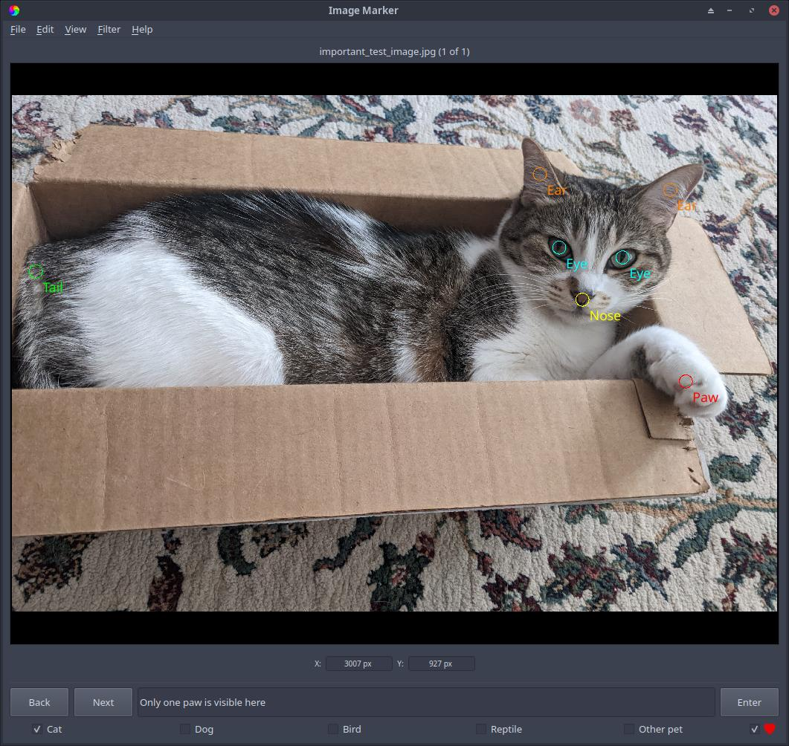

Categorizing and commenting
======================

The user can also categorize images and enter comments for the image.

- Images can be placed into any number of 5 ``categories`` (an image can be in multiple ``categories``).
- These ``categories`` are listed as checkboxes in the bottom panel of Image Marker; clicking these checkboxes will place the image in that ``category``.
- In the bottom panel, comments can be entered for the current image. This information is saved in the save directory in a file named ``<username>_images.txt``.
- The user can also click the heart button on the far right of the bottom panel, which will add the image to the user's favorites. A list of favorited images is saved in ``<username>_favorites.txt``.

  Figure 1: An image of a cat (Zoe!) in a box. The "Cat" ``category`` is selected, the comment box contains a comment relevant to the image, and several different ``groups`` of ``marks`` are used here. This image has also been favorited, as seen in the bottom right (indicated by the full heart).
