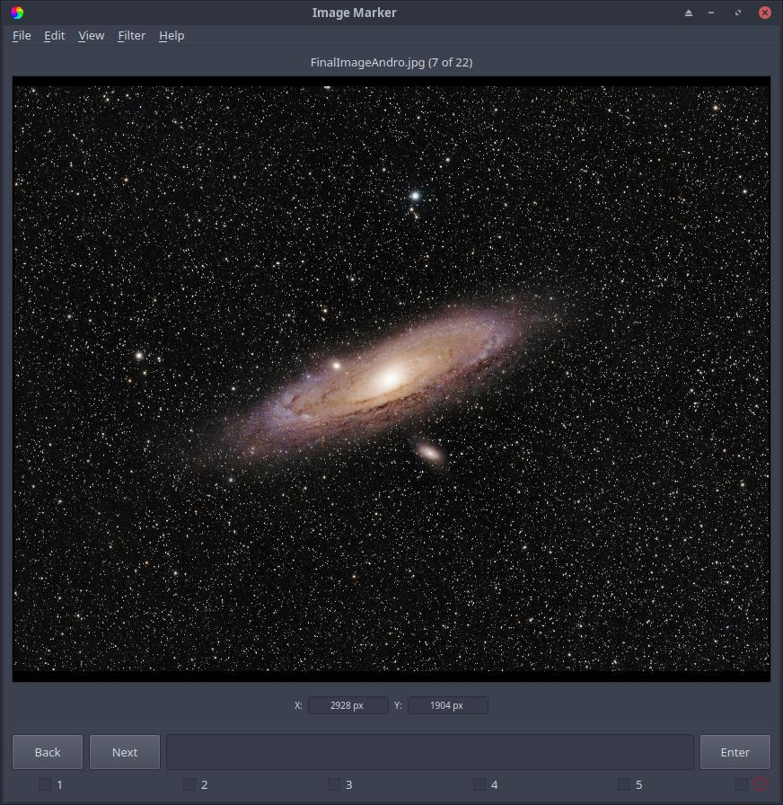
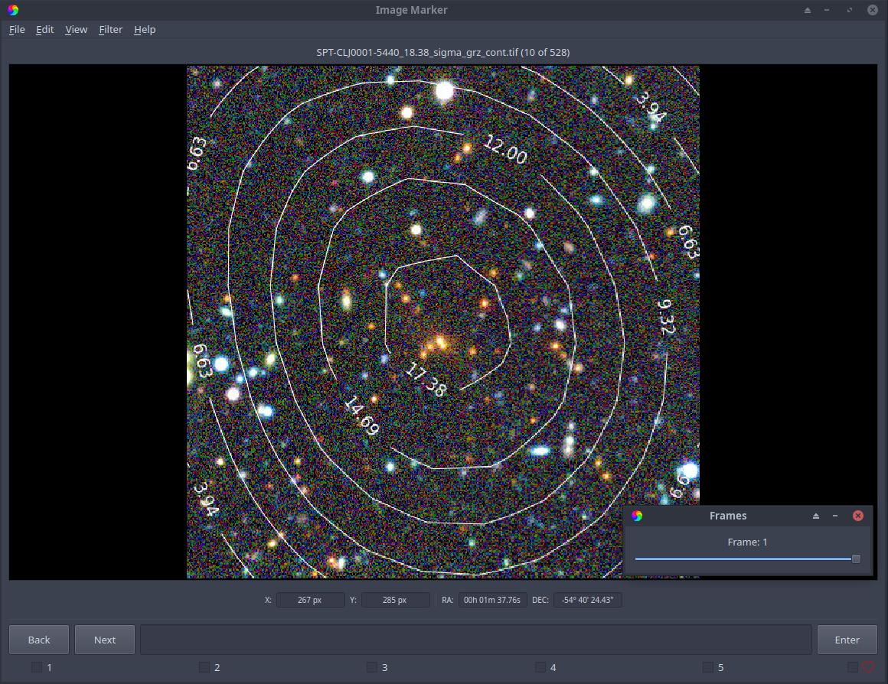

Loading
======================

Supported image formats
----------

Currently, Image Marker supports the following image formats (file types):

- FITS/FIT
- TIFF/TIF
- JPEG/JPG
- PNG

These formats are supported with the following limitations:

- FITS/FIT

  - Files **MUST** have only an image(s) in them, as any FITS/FIT file with a table or other data that isn't image data (header data is of course okay) will not be handled by Image Marker
  - Image Marker will only show FITS/FIT in grayscale, since there is no functionality for creating RGB images from grayscale images in Image Marker
  - Supports logging WCS coordinates (RA and Dec in degrees)
  - Supports multiple frames (if two images are embedded in one file, seeking to the other image within the same file is available)
  - 8 and 16 bit

- TIFF/TIF

  - Supports RGB and grayscale images
  - Supports logging WCS coordinates (RA and Dec in degrees)

    - *Only when WCS solution is embedded in the TIFF/TIF header using* `STIFF <https://www.astromatic.net/software/stiff/>`_ *to embed WCS solutions*

  - Supports multiple frames (if two images are embedded in one file, seeking to the other image within the same file is available)
  - Supports 8 bit images

- JPEG/JPG

  - Supports RGB and grayscale images
  - *Does not* support logging WCS coordinates
  - Supports 8 bit images

- PNG

  - Supports RGB with Alpha channel and grayscale images
  - **Does not** support logging WCS coordinates
  - Supports 8 bit images

Image loading
------------

When Image Marker is first opened, the user is prompted to select the directory in which all of their output data will be automatically saved (see Figure 1 below). The currently supported image formats are under `Supported image formats`_. In short, FITS files support up to a 16 bit depth, which is a limitation of PyQt. For TIFFs, PNGs and JPEGs, Image Marker currently only officially supports RGB color channels with 8 bits per channel, alpha channels in PNGs and JPEGs, and grayscale images (luminance channel) in TIFF, but this may be expanded in the future. 
Pillow is used to open TIFF, PNG and JPEG files. Though Pillow can currently handle FITS files, this is a relatively recent feature. As such we use astropy to open FITS files, so as to maintain compatibility with older versions of Python. 

  Figure 1: The prompt for selecting a save directory, the first window that comes up after running Image Marker. Notice that the prompt has a label at the top, indicating what directory to choose (save directory or image directory).

The user is then prompted to select the directory from which to load images (see Figure 2 below).

  Figure 2: The prompt for selecting an image directory. This prompt comes up after selecting a save directory, as shown in Figure 1. Notice that this prompt is also labeled at the top, indicating to choose the image directory.

After an image directory is selected, Image Marker opens each image in the image directory that matches the supported formats and prepares them for viewing, while displaying the first image (see Figure 3 below).

  Figure 3: An exammple of how Image Marker should look after selecting save and image directories, with the exception of what image is displayed (dependent on the images in the chosen image directory). Image credit: `Ryan Walker <https://astrorya.github.io>`_

Image Marker can handle multi-frame FITS and TIFF files. If a file has multiple frames, these frames can be cycled through using spacebar, or by using the **View > Frames** dialog (see Figure 4 below). WCS information stored in FITS and TIFF files is also accessed by Image Marker. If an image contains a WCS solution in its header, Image Marker will display the WCS coordinates of the cursor in addition to the pixel coordinates (see Figure 4 below).

  Figure 4: Here, we show an example of a TIFF image that contains a WCS solution and multiple frames. We also show the Frames window in the bottom right of the image display. Image credit: DeCALS `(Dey et al., 2019) <https://doi.org/10.3847/1538-3881/ab089d>`_, Contours: SPT-3G

Figure 4 illustrates that x and y pixel coordinates and RA and Dec. coordinates (embedded using `STIFF <https://www.astromatic.net/software/stiff/>`_) of the cursor are displayed above the comment box. Figure 4 also shows the Frames window in the bottom right of the image display, indicating that the second frame of the image file is being shown (frames are index 0, so frame 0 is the first image and frame 1 is the second image in the file).

.. Note::
  If you have questions or run into problems with this process, please reach out to us in an `issue <https://github.com/andikisare/imgmarker/issues>`_ report.
