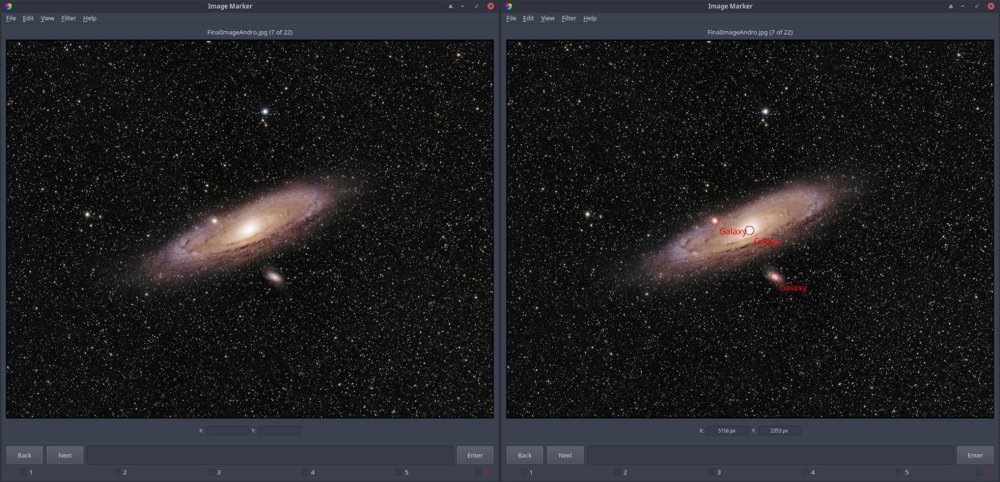

Marking images
======================

- ``Marks`` can be placed in any of 9 ``groups``.
- The user can place a ``mark`` by pressing any number on the keyboard between 1 and 9.
- Pressing each number will place a ``mark`` at the location of the cursor, and in the ``group`` associated with that number.
- The names of each ``group`` can be modified in **Edit > Settings**.
- Once a ``mark`` is placed, its pixel coordinates, WCS coordinates (if applicable), ``group``, label, the name of the image associated with the ``mark``, and the current date are all saved into ``<username>_marks.txt``.
- The label of the ``mark`` can be modified simply by clicking on the label of the ``mark``, and typing. Pressing enter, or clicking outside the label, will save this information into the same text file. *This does not change the name of the* ``group`` *that the* ``mark`` *is in; the label is saved separately.*

The left panel in Figure 1 shows an image of Messier 31, a nearby galaxy, before placing ``marks``, while the right panel shows the same image but after each galaxy in the image is ``marked`` with the ``group`` "Galaxy" (which is the first ``group`` here, placed using the left mouse button or the "1" key on the keyboard).

  Figure 1: Before and after placing ``marks`` to identify each galaxy in the image. Image credit: `Ryan Walker <https://astrorya.github.io>`_
