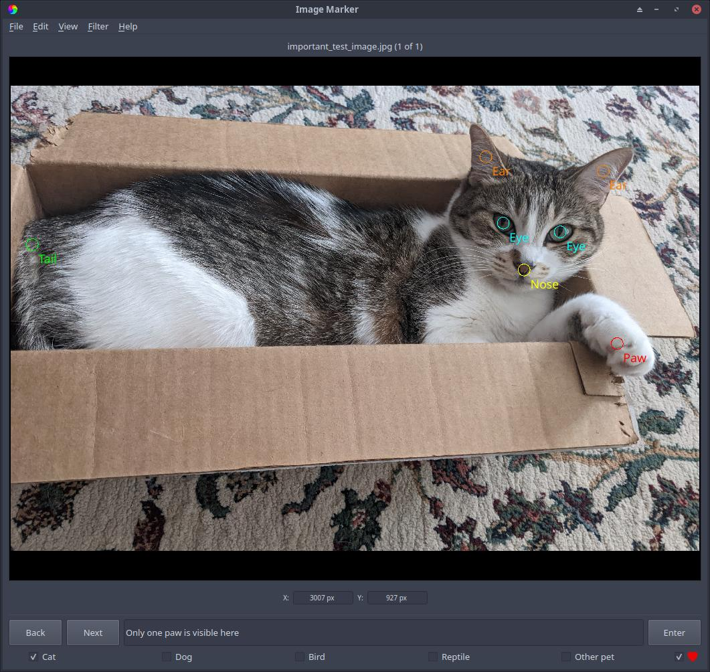

.. _categories:

Image categories and comments
======================
The user can also categorize images and enter comments for the image.

Image categories are used for classifying images as a whole. The categories of an image is accessed through its :py:attr:`~imgmarker.image.Image.categories` attribute.

Pressing the category box for an image (or their respective keyboard shortcuts) will save that image's category in the images file (``<username>_images.txt``) in your save directory. For example, if you have 10 images total, 3 contain one cat each, 3 contain one dog each, and 4 contain one bird each, and you want to sort these images based on what pet is in them, you can name one image category "cat," another as "dog," and the last as "bird," and based on what is in the image, click that category box to categorize each image into each pet type. While this is a similar idea as to marks, it's important to note that image categories are specifically meant for classifying **an entire image**, whereas marks are for classifying one or many features **within an image**.

- Images can be placed into any number of 5 categories (an image can be in multiple categories).
- These categories are listed as checkboxes in the bottom panel of Image Marker; clicking these checkboxes will place the image in that category.
- In the bottom panel, comments can be entered for the current image. This information is saved in the save directory in a file named ``<username>_images.txt``.
- The user can also click the heart button on the far right of the bottom panel, which will add the image to the user's favorites. A list of favorited images is saved in ``<username>_favorites.txt``.

  Figure 1: An image of a cat (Zoe!) in a box. The "Cat" category is selected, the comment box contains a comment relevant to the image, and several different :ref:`groups <groups>` of :ref:`marks <marks>` are used here. This image has also been favorited, as seen in the bottom right (indicated by the full heart).
