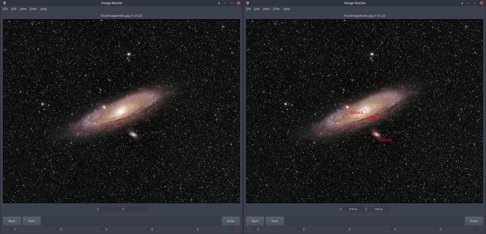

.. _marks:

Marks
======================

Marks are used to identify features in a particular image, like a cat's four paws. They are instantiated through the :py:class:`~imgmarker.gui.mark.Mark` class. 

- Marks can be placed in any of 9 :ref:`groups <groups>`
- Placing a mark will save the x and y pixel coordinates (and right ascension and declination if available) of the center of that mark in the marks file (``<username>_marks.csv``) in your save directory.
- The maximum number of marks in a group can be customized in **Edit > Settings**.
- If you place a mark in a group with a limit of 1, then placing another mark will replace the original mark with a new mark at the cursor.
- The user can place a mark by pressing any number on the keyboard between 1 and 9.
- Pressing each number will place a mark at the location of the cursor, and in the group associated with that number.
- The names of each group can be modified in **Edit > Settings**.
- Once a mark is placed, its pixel coordinates, WCS coordinates (if applicable), group, label, the name of the image associated with the mark, and the current date are all saved into <username>_marks.csv.
- The label of the mark can be modified simply by clicking on the label of the mark, and typing. Pressing enter, or clicking outside the label, will save this information into the same text file. *This does not change the name of the* group *that the* mark *is in; the label is saved separately.*

The left panel in Figure 1 shows an image of Messier 31, a nearby galaxy, before placing marks, while the right panel shows the same image but after each galaxy in the image is marked with the group "Galaxy" (which is the first group here, placed using the left mouse button or the "1" key on the keyboard).

  Figure 1: Before and after placing marks to identify each galaxy in the image. Image credit: `Ryan Walker <https://astrorya.github.io>`_

Importing mark files
----------
Mark files can be imported via **File > Import Mark File**. Any imported mark files will be copied into your save directory under ``imports``. Mark files that you import must be comma-separated and have at least three columns: ``label``, ``RA`` and ``DEC`` or ``label``, ``x`` and ``y``. Check out `here <https://github.com/andikisare/imgmarker/blob/main/imgmarker/tests/TEST_catalog.csv>` for an example.

If a mark file does not specify an image under the ``image`` column, then each time you look at an image, Image Marker will show all marks that have pixel coordinates or wcs coordinates that are within the bounds of the image. For this reason, if you have many marks in the mark file that don't have a specified image, this may slow down Image Marker when cycling between images.

If the mark file specifies wcs coordinates rather than pixel coordinates, make sure that all of your images have a WCS solution.