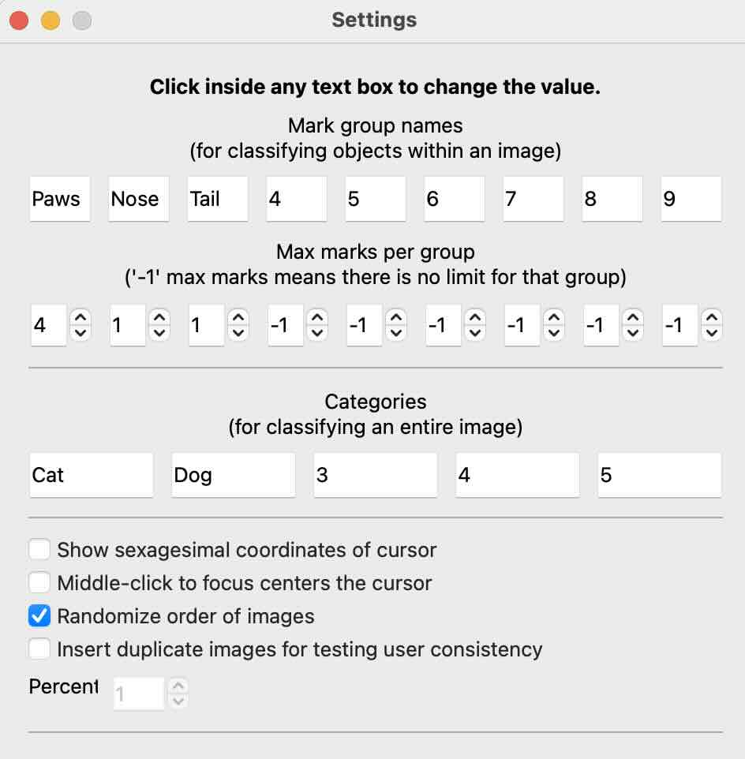

Configuration
======================

Settings
---------------------
Settings can be configured within the GUI (**Image Marker > Preferences** (MacOS) or **Edit > Settings** (Windows/Linux)) or directly edited in the configuration file (``<username>_config.txt``). Right now, only some settings are available in the configuration file, while everything is available in the GUI.

Note: While there are only 9 distinct **mark**s  available, users can combine **image category** with **mark**s to make 59 unique flagged combinations.
 
.. list-table:: Settings available for editing within the GUI (**Image Marker > Preferences** (MacOS) or **Edit > Settings** (Windows/Linux))
   :widths: 50 50
   :header-rows: 1

   * - Setting
     - Description
   * - Groups
     - The name of each :ref:`mark <marks>` can be customized here for your specific purpose. The names are in order of their keybinds, so the far left text box corresponds to pressing "1" on the keyboard and the far right text box corresponds to pressing "9" on the keyboard. The keybind attached to the Left Mouse Button (click on MacOS trackpad) can be customized in the settings.
   * - Max marks per group
     - The maximum allowed number of :ref:`marks <marks>` in their respective group can be customized here. A value of "-1" indicates no limit on that group. As with group names above, the far left number box corresponds to the first group.
   * - Categories
     - Each :ref:`image category <categories>` name can be customized here for your specific purpose. The category names are in order of their keybinds, so the far left text box corresponds to pressing "Cmd+1" (Mac OS) or "Ctrl+1" (Windows/Linux) on the keyboard, and the far right text box corresponds to pressing "Cmd+5" (MacOS) "Ctrl+5" (Windows/Linux) on the keyboard.
   * - Middle-click to focus centers the cursor 
     - Enabling this option will center your cursor in the image display window when clicking on the scroll wheel. Since middle-clicking pans to the cursor, this option will place your cursor where you pan to after panning. **On MacOS holding option while clicking the track pad has the same functionality.**
   * - Left mouse clicks marks group: 
     - Drop down menu allowing assigmnet of which mark is assigned on Left Mouse/trackpad click. 
   * - Randomize order of images
     - Randomizes the order that images are shown when pressing next. If enabled, images that have already been viewed keep their order when disabling and re-enabling this option.
   * - Insert duplicate images for testing user consistency
     - If enabled, randomly shows images that have already been viewed and have at least one mark. The percentage of the loaded dataset to show again can be tuned with the "Percentage of dataset to duplicate" parameter below.
   * - Percentage of dataset to duplicate
     - A higher percentage corresponds to a higher likelihood to see the same image twice. 

.. list-table:: Settings available for editing within the configuration file
   :widths: 50 50
   :header-rows: 1

   * - Setting
     - Description
   * - ``image_dir``
     - The image directory, where Image Marker looks for images of all supported formats. This can be changed in the GUI as well (**File > Open Images...**).
   * - ``groups`` 
     - The name of each group. Names must not contain commas. This can be changed in the GUI as well (**Image Marker > Preferences** in MacOS or **Edit > Settings** in Windows/Linux).
   * - ``categories``
     - The name of each category. Names must not contain commas. This can be changed in the GUI as well (**Image Marker > Preferences** in MacOS or **Edit > Settings** in Windows/Linux).
   * - ``group_max``
     - The maximum number of marks that can be placed for a particular group. The position of the value that is replaced in this variable corresponds to which group it limits. This can be changed in the GUI as well (**Image Marker > Preferences** in MacOS or **Edit > Settings** in Windows/Linux).
   * - ``randomize_order``
     - True or False, whether or not the displayed images are shuffled randomly or displayed in alphabetical order. This can be changed in the GUI as well (**Image Marker > Preferences** in MacOS or **Edit > Settings** in Windows/Linux).
   * - ``left_click_group``
     - Number of group (1-9) to assign to the left mouse click/trackpad click.  
.. Note::
   - Renaming groups or categories after already having classified some images into the corresponding group of marks or category **will rename** the groups and categories in your save files, as well as all marks in the renamed groups that have already been placed.
   - Decreasing the value of a groups' max marks **will not** delete any previously made marks on any image, since there is no way for Image Marker to decide which marks take priority. This means that changes in max marks per group will only be applied going forward.

Example
---------------------

This configuration::

   image_dir = /home/username/science/cats
   groups = Paws,Nose,Tail,4,5,6,7,8,9
   categories = Cat,Dog,3,4,5
   group_max = 4,1,1,None,None,None,None,None,None
   randomize_order = True
   left_click_group = 2

* renames group 1 to "Paws" and limits the number of marks in the group "Paws" to 4
* renames group 2 to "Nose" and limits the number of marks in group "Nose" to 1
* renames group 3 to "Tail" and limits the number of marks in group "Tail" to 1
* renames category 1 to "Cat" and
* renames category 2 to "Dog"
* sets the group marked by a left-mouse/trackpad click to "Nose" (the 2nd group). 
 
The same configuration would appear in the Settings window as below:

